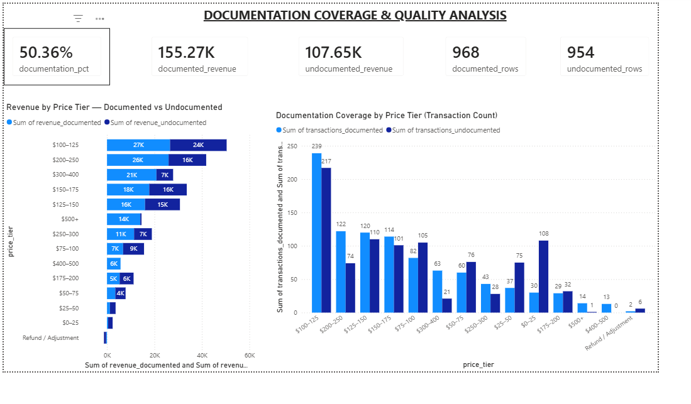
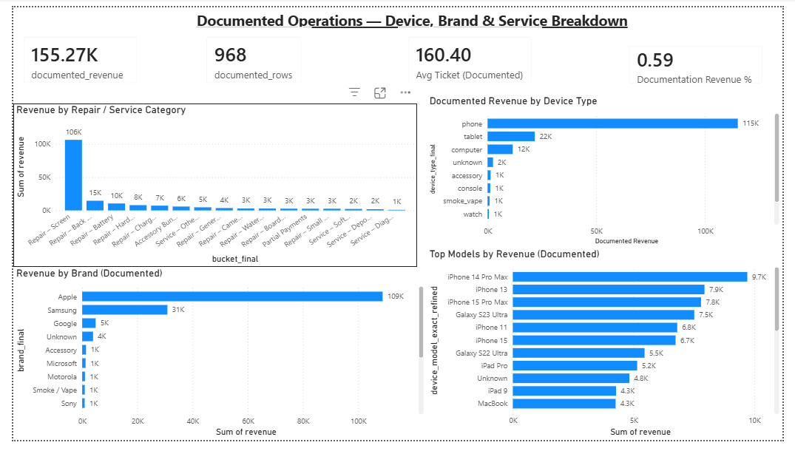
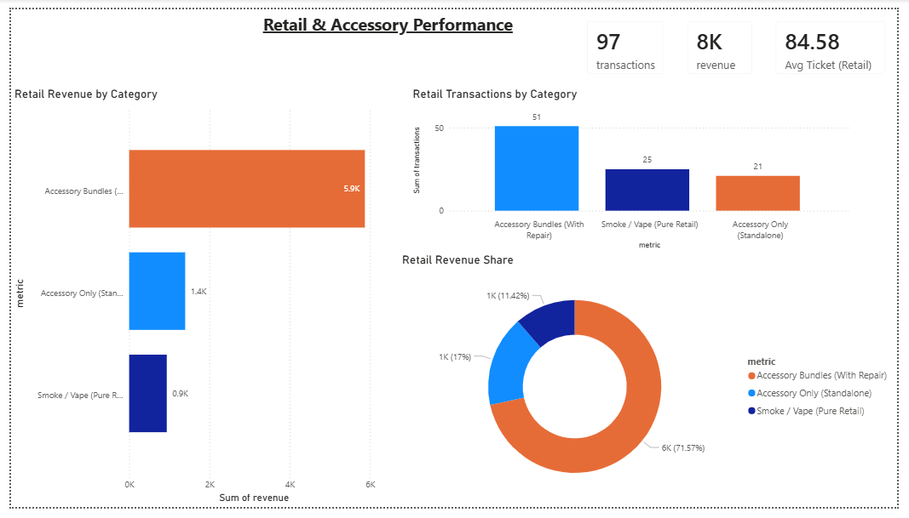
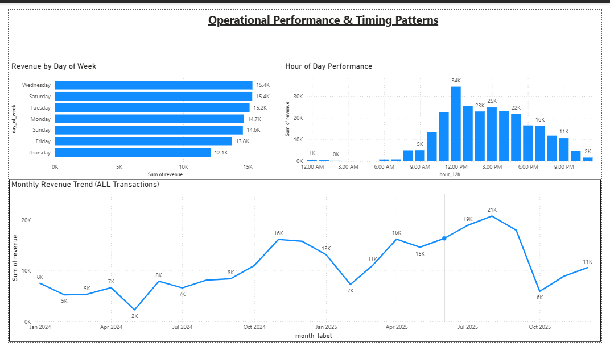

 
# Paragon Geeks — Transaction-Level Sales & Operations Analytics

> **TL;DR:** End-to-end transaction-level analytics project using real Square POS data.  
> Built an audit-safe **Python → Power BI** pipeline to analyze documentation coverage, repair mix, pricing tiers, and operational performance for a multi-location electronics repair & retail business.

---

## Project Overview

This project delivers an end-to-end, transaction-level analytics pipeline built on **Square POS data** for Paragon Geeks, a multi-location electronics repair and retail business.

The objective was to transform raw, inconsistent point-of-sale exports into **audit-safe operational insights** that support executive decision-making, while preserving real-world data complexity.

The final output includes:
- A fully documented analytics notebook  
- Normalized, locked fact and dimension tables  
- An executive-ready **Power BI dashboard** designed for business stakeholders  

---

## Table of Contents

- [Business Problem](#business-problem)
- [Data Source](#data-source)
- [Methodology](#methodology)
- [Key Insights](#key-insights)
- [Power BI Dashboard Preview](#dashboard-preview)
- [Data Pipeline Overview](#data-pipeline-overview)
- [Repository Structure](#repository-structure)
- [How to Reproduce This Analysis](#how-to-reproduce-this-analysis)

## Business Problem

Like many service-based retail businesses, Paragon Geeks faced operational and analytical challenges caused by inconsistent point-of-sale documentation and unstructured transaction data.

Key challenges included:
- Inconsistent transaction documentation across locations and employees
- Heavy reliance on free-text service descriptions
- Limited visibility into repair mix, pricing tiers, and operational timing
- Inability to reliably link revenue performance to documentation quality

These issues made it difficult to answer basic executive questions such as:
- What services truly drive revenue?
- Where is undocumented revenue concentrated?
- How does pricing relate to documentation discipline?
- When do peak operational windows occur?

This project addresses those challenges by enforcing transaction-level consistency while preserving real-world data complexity.

---

## Data Source

- Square POS exports from **2024 and 2025**
- Approximately **1,900 total transactions**
- Combination of structured fields (prices, timestamps, items) and unstructured free-text notes
- Includes both **documented** and **undocumented** transactions

Raw exports are preserved without modification to maintain audit traceability.

---

## Methodology

The analytics pipeline follows a strict, audit-safe methodology designed to prevent silent recomputation and metric drift.

Key methodological steps include:
- Ingestion and normalization of multiple Square export formats
- Enforcement of transaction grain (**1 row = 1 transaction**)
- Explicit separation of documented vs undocumented transactions
- Token-based parsing of free-text descriptions to extract:
  - Repair vs retail classification
  - Device type, brand, and model
  - Service categories and complexity indicators
- Construction of locked fact and dimension tables
- Validation of all aggregates against known revenue totals
- Export of clean, Power BI–ready datasets

All presentation tables and Power BI visuals are generated exclusively from validated, locked outputs.  
No manual overrides or Power BI-side transformations are applied.

## Key Insights

This analysis produced clear, executive-level insights by enforcing transaction-level consistency across all Square POS data.

### Revenue & Documentation Coverage
- **$262,919.10** in total revenue analyzed across **1,922 transactions**
- **59.1% of revenue** is fully documented (**$155,265.60**)
- **40.9% of revenue** (**$107,653.50**) remains undocumented
- Documentation gaps represent a material reporting and audit risk

### Repair & Service Mix
- **Screen repairs dominate operations**, accounting for over **$106K** in documented revenue across **600+ transactions**
- A small number of repair categories (Screen, Back Glass, Battery) generate the majority of operational revenue
- Multi-repair and bundled service transactions carry higher average ticket values

### Pricing & Documentation Behavior
- Higher-priced repairs (**>$200**) show significantly stronger documentation discipline
- Undocumented revenue is disproportionately concentrated in **mid-price tiers**
- Improving documentation in the $100–$200 range would materially increase data quality without changing volume

### Operational Timing
- Peak operational window occurs between **11:00 AM and 3:00 PM**
- Midday hours capture the highest transaction volume and revenue
- Time-based patterns present opportunities for staffing and scheduling optimization

### Retail & Accessory Performance
- **Accessory bundles attached to repairs outperform standalone accessory sales by over 4× in revenue**
- Bundled retail activity significantly increases average ticket size
- Standalone accessory sales contribute limited revenue relative to repair-attached sales

These insights are derived exclusively from audit-safe, processed datasets and reconcile exactly to validated notebook outputs.

## Power BI Dashboard Preview

The Power BI dashboard was built as the final presentation layer for this project and connects **exclusively** to audit-safe datasets generated by the Python notebook pipeline.

No raw data is loaded into Power BI.  
No Power Query transformations are applied.  
All calculations are implemented using DAX measures to preserve metric integrity.

### Dashboard Structure

The dashboard is organized into **five focused analytical pages**, each designed to answer a specific business question.

---

### Page 1 — Executive Overview
**Purpose:** High-level performance snapshot for leadership.

**Key visuals:**
- Total Revenue (All Transactions)
- Documented vs Undocumented Revenue Share
- Documentation Coverage %
- Average Ticket Size
- Revenue Trend Over Time

**Business value:**  
Provides immediate visibility into overall sales performance while clearly exposing the documentation gap affecting analytical accuracy.

---

### Page 2 — Repair & Service Mix
**Purpose:** Understand what drives revenue operationally.

**Key visuals:**
- Revenue by Repair / Service Category (`bucket_final`)
- Transaction Count by Repair Type
- Accessory Bundles vs Standalone Accessories

**Business value:**  
Identifies the most profitable repair categories and highlights opportunities to optimize pricing, staffing, and upsell strategies.

---

### Page 3 — Device & Brand Performance
**Purpose:** Analyze demand by device ecosystem.

**Key visuals:**
- Revenue by Device Type (Phone, Tablet, Computer, etc.)
- Revenue by Brand (Apple, Samsung, Google, etc.)
- Top 25 Device Models by Revenue

**Business value:**  
Supports inventory planning, technician specialization, and targeted marketing based on high-demand devices.

---

### Page 4 — Pricing & Documentation Analysis
**Purpose:** Evaluate pricing strategy and data quality simultaneously.

**Key visuals:**
- Revenue by Price Tier
- Documented vs Undocumented Share by Price Tier
- Average Ticket by Price Tier

**Business value:**  
Reveals where high-value work lacks documentation and where improved operational discipline would significantly increase reporting reliability.

---

### Page 5 — Time-Based Performance
**Purpose:** Optimize staffing and operating hours.

**Key visuals:**
- Revenue by Hour of Day
- Revenue by Day of Week
- Monthly Revenue Trends

**Business value:**  
Informs staffing allocation, scheduling decisions, and promotional timing based on actual transaction behavior.

---

### Design Principles
- One fact table drives all visuals
- All metrics calculated using DAX
- No hidden filters or silent exclusions
- All totals reconcile exactly to notebook validation outputs


## Repository Structure & Data Pipeline Overview

This repository is organized to clearly separate raw data, processing logic, and presentation layers.  
The structure enforces audit safety, reproducibility, and prevents metric drift between analysis and reporting.

### Repository Structure

```text
paragon-geeks-sales-analytics/
│
├── data/
│   ├── raw/                 # Original Square POS exports (never modified)
│   └── processed/           # Locked, audit-safe CSV outputs used for reporting
│
├── notebooks/               # Python data cleaning, classification, and analysis pipeline
│
├── powerbi/                 # Executive Power BI dashboard (.pbix)
│
├── images/                  # Dashboard screenshots used in README documentation
│
└── README.md                # Project overview, methodology, and findings
```

## Data Pipeline Overview

This project follows a strict, transaction-level analytics pipeline designed to ensure audit safety, reproducibility, and metric integrity from ingestion through visualization.

### 1. Raw Data Ingestion
- Square POS exports from 2024 and 2025 are ingested without modification.
- Raw files are preserved in `data/raw/` for traceability and audit purposes.

### 2. Data Cleaning & Normalization
- Transaction-level data standardized across years.
- Revenue fields normalized with refunds handled explicitly.
- Transaction grain enforced: **1 row = 1 transaction**.

### 3. Text Parsing & Classification
- Token-based parsing of free-text transaction descriptions.
- Repairs, services, accessories, and retail activity classified without hardcoding assumptions.
- Device type, brand, and model extracted from transaction text.
- Multi-repair, partial payments, and bundled transactions explicitly flagged.

### 4. Documentation Coverage Analysis
- Transactions categorized as **Documented** or **Undocumented** based on description quality.
- Documentation coverage analyzed across revenue, transaction volume, and price tiers.

### 5. Locked Outputs
- Final datasets exported to `data/processed/`.
- These CSVs are treated as immutable and serve as the **single source of truth** for Power BI.
- No downstream recomputation, Power Query transformations, or manual overrides are permitted.


## How to Reproduce This Analysis

This project is designed to be fully reproducible and audit-safe.  
All results shown in the notebook and Power BI dashboard are derived exclusively from processed datasets generated by the notebook pipeline.

### Clone the Repository

git clone https://github.com/KevinTurneri/paragon-geeks-sales-analytics.git  
cd paragon-geeks-sales-analytics

### Place Raw Data Files

Place the original Square POS exports into the following directory:

data/raw/  
├── 2024 sales.csv  
└── 2025 sales.csv  

Raw files are treated as immutable source data and are never modified directly.

### Run the Analysis Notebook

Open the main notebook located at:

notebooks/paragon_geeks_transaction_level_analysis.ipynb

Run all cells top-to-bottom to:

- Normalize transaction-level data across years  
- Enforce transaction grain (1 row = 1 transaction)  
- Parse free-text descriptions using token-based classification  
- Classify repairs, services, accessories, and retail activity  
- Apply documentation coverage flags  
- Validate all transaction counts and revenue totals  
- Export audit-safe datasets to the data/processed directory  

### Generated Outputs

After execution, the following locked datasets are created:

data/processed/  
fact_repair_service.csv  
dim_device_type.csv  
dim_brand.csv  
dim_model_top25.csv  
kpi_accessory.csv  
price_tier_totals.csv  
documentation_share_by_price_tier.csv  
hourly_performance.csv  
dow_performance.csv  
monthly_performance.csv  

These files serve as the single source of truth for all reporting.

### Open the Power BI Dashboard

Open the Power BI file located at:

powerbi/Paragon_Geeks_Executive_Dashboard.pbix

- Dashboard connects only to data/processed  
- No Power Query transformations  
- All calculations performed using DAX  
- No hidden filters or silent exclusions  

### Reproducibility & Integrity Guarantees

- Raw data is never altered  
- Metrics reconcile exactly to notebook validation totals  
- Power BI uses processed data only  
- No silent recomputation or metric drift  
- Full traceability from raw data to final dashboard

## How to Reproduce This Analysis

This project is designed to be fully reproducible and audit-safe.  
All results shown in the notebook and Power BI dashboard are derived exclusively from processed datasets generated by the notebook pipeline.

### Clone the Repository

git clone https://github.com/KevinTurneri/paragon-geeks-sales-analytics.git  
cd paragon-geeks-sales-analytics

### Place Raw Data Files

Place the original Square POS exports into the following directory:

data/raw/  
├── 2024 sales.csv  
└── 2025 sales.csv  

Raw files are treated as immutable source data and are never modified directly.

### Run the Analysis Notebook

Open the main notebook located at:

notebooks/paragon_geeks_transaction_level_analysis.ipynb

Run all cells top-to-bottom to:

- Normalize transaction-level data across years  
- Enforce transaction grain (1 row = 1 transaction)  
- Parse free-text descriptions using token-based classification  
- Classify repairs, services, accessories, and retail activity  
- Apply documentation coverage flags  
- Validate all transaction counts and revenue totals  
- Export audit-safe datasets to the data/processed directory  

### Generated Outputs

After execution, the following locked datasets are created:

data/processed/  
fact_repair_service.csv  
dim_device_type.csv  
dim_brand.csv  
dim_model_top25.csv  
kpi_accessory.csv  
price_tier_totals.csv  
documentation_share_by_price_tier.csv  
hourly_performance.csv  
dow_performance.csv  
monthly_performance.csv  

These files serve as the single source of truth for all reporting.

### Open the Power BI Dashboard

Open the Power BI file located at:

powerbi/Paragon_Geeks_Executive_Dashboard.pbix

- Dashboard connects only to data/processed  
- No Power Query transformations  
- All calculations performed using DAX  
- No hidden filters or silent exclusions  

### Reproducibility & Integrity Guarantees

- Raw data is never altered  
- Metrics reconcile exactly to notebook validation totals  
- Power BI uses processed data only  
- No silent recomputation or metric drift  
- Full traceability from raw data to final dashboard

## How to Reproduce This Analysis

This project is designed to be fully reproducible and audit-safe.  
All results shown in the notebook and Power BI dashboard are derived exclusively from processed datasets generated by the notebook pipeline.

### Clone the Repository

git clone https://github.com/KevinTurneri/paragon-geeks-sales-analytics.git  
cd paragon-geeks-sales-analytics

### Place Raw Data Files

Place the original Square POS exports into the following directory:

data/raw/  
├── 2024 sales.csv  
└── 2025 sales.csv  

Raw files are treated as immutable source data and are never modified directly.

### Run the Analysis Notebook

Open the main notebook located at:

notebooks/paragon_geeks_transaction_level_analysis.ipynb

Run all cells top-to-bottom to:

- Normalize transaction-level data across years  
- Enforce transaction grain (1 row = 1 transaction)  
- Parse free-text descriptions using token-based classification  
- Classify repairs, services, accessories, and retail activity  
- Apply documentation coverage flags  
- Validate all transaction counts and revenue totals  
- Export audit-safe datasets to the data/processed directory  

### Generated Outputs

After execution, the following locked datasets are created:

data/processed/  
fact_repair_service.csv  
dim_device_type.csv  
dim_brand.csv  
dim_model_top25.csv  
kpi_accessory.csv  
price_tier_totals.csv  
documentation_share_by_price_tier.csv  
hourly_performance.csv  
dow_performance.csv  
monthly_performance.csv  

These files serve as the single source of truth for all reporting.

### Open the Power BI Dashboard

Open the Power BI file located at:

powerbi/Paragon_Geeks_Executive_Dashboard.pbix

- Dashboard connects only to data/processed  
- No Power Query transformations  
- All calculations performed using DAX  
- No hidden filters or silent exclusions  

### Reproducibility & Integrity Guarantees

- Raw data is never altered  
- Metrics reconcile exactly to notebook validation totals  
- Power BI uses processed data only  
- No silent recomputation or metric drift  
- Full traceability from raw data to final dashboard


## Dashboard Preview

Below are selected previews from the executive Power BI dashboard.  
All visuals are generated exclusively from audit-safe processed datasets.

### Executive Overview


### Documentation Coverage


### Documented Operations


### Retail Performance


### Operational Timing



