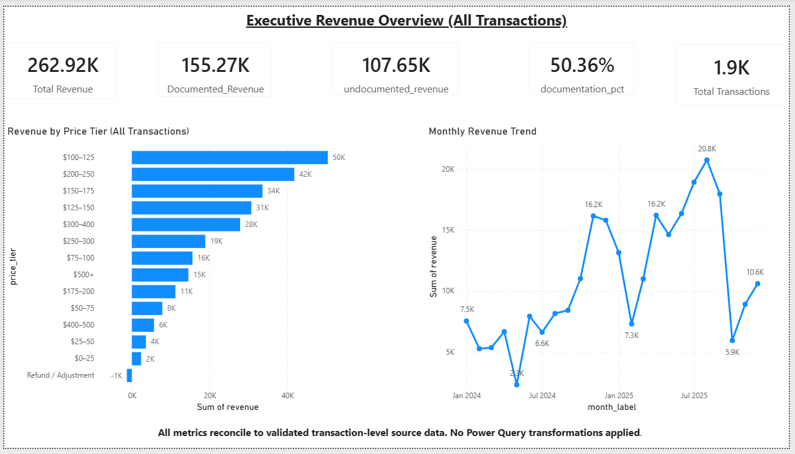
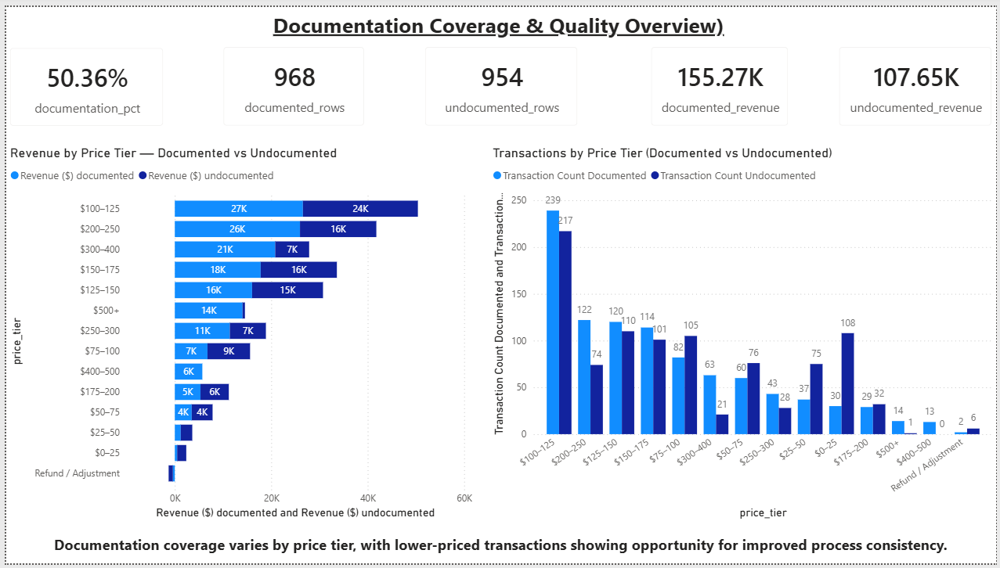
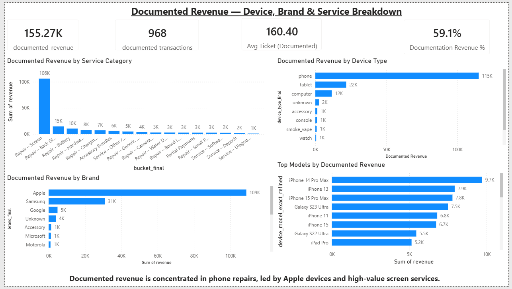
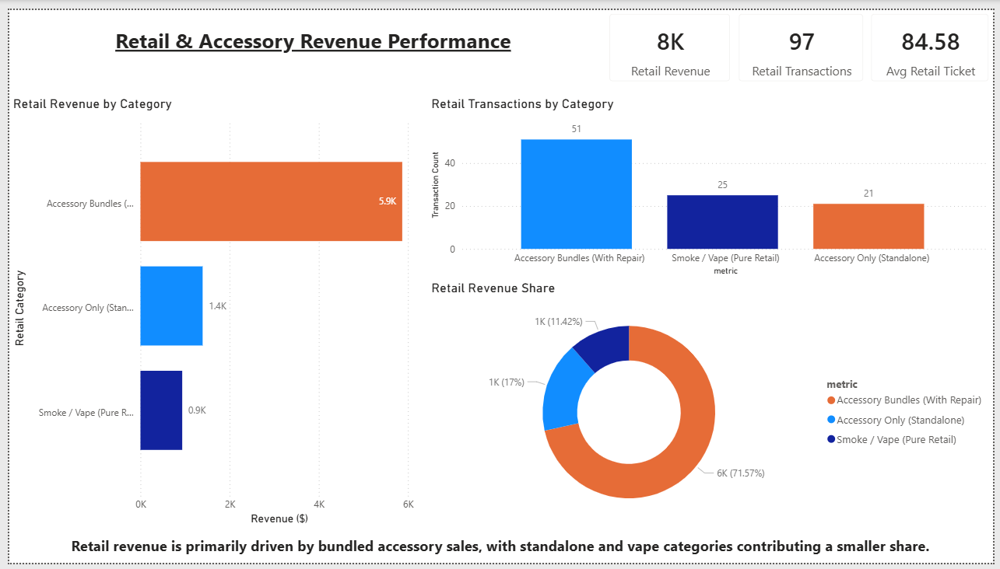
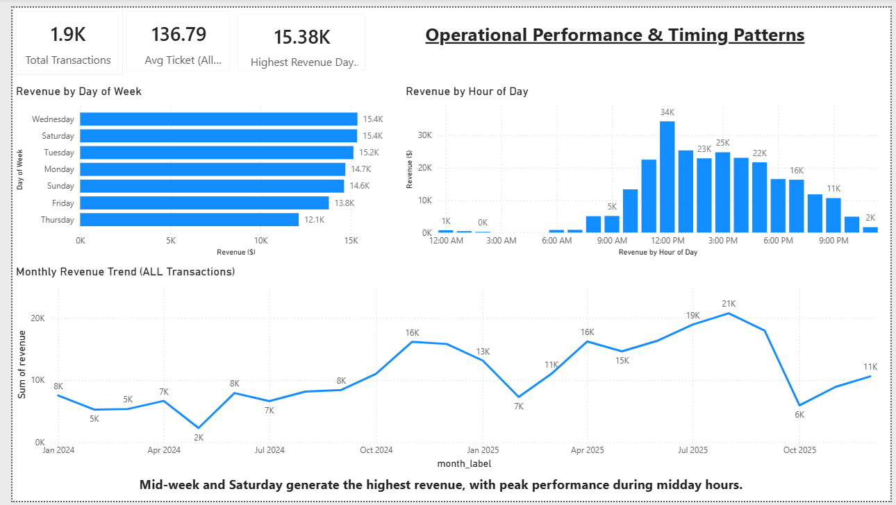

# Paragon Geeks — Transaction-Level Sales & Operations Analytics (Square POS)

## Executive Overview

While managing operations across two retail electronics repair locations, I designed and implemented a transaction-level operational intelligence system analyzing **$262,919.10 in revenue across 1,922 live POS transactions**.

This project transforms unstructured Square POS exports into a governed, audit-aligned analytics framework capable of supporting executive decision-making in a real-world retail environment.

## My Role

- Operations Manager overseeing two retail locations
- Managed technician workflow, customer intake, and revenue tracking
- Initiated and led internal analytics initiative to quantify revenue integrity, documentation risk, and operational performance
- Designed and implemented full raw → processed → dashboard pipeline independently

### Core Outcomes

- Reconciled 100% of revenue to transaction-level source exports  
- Quantified **$107,653.50 (40.9%) in undocumented revenue exposure**  
- Identified documentation discipline gaps concentrated in $100–$200 repair tiers  
- Isolated peak operational window (11 AM–3 PM) for staffing optimization  
- Measured 4× revenue lift from accessory bundles vs standalone sales  
- Built executive Power BI dashboard driven exclusively by validated outputs  

**Tools:** Python (pandas, numpy), Rule-Based NLP Feature Engineering, Jupyter Notebook, Power BI (DAX), GitHub, Square POS exports  

**Focus Areas:** Operational Analytics | Revenue Governance | Data Engineering | Business Intelligence | Retail Intelligence

---

## Project Overview

This project delivers an end-to-end, transaction-level analytics pipeline built on Square POS data for Paragon Geeks, a multi-location electronics repair and retail business.

The objective was to transform raw, inconsistent point-of-sale exports into **audit-safe operational insights** that support executive decision-making, while preserving real-world data complexity.

---

## Why This Project Matters

Retail POS data is often inconsistent, free-text heavy, and operationally messy. 

This project demonstrates the ability to:

- Govern imperfect business data without distorting reality  
- Quantify financial reporting risk tied to documentation behavior  
- Normalize unstructured transaction text into structured analytical dimensions  
- Translate operational data into executive-level decision intelligence  

This mirrors real enterprise analytics environments where data integrity, reproducibility, and business alignment are critical.


### Final Outputs
- A fully documented analytics notebook  
- Normalized, locked fact and dimension tables  
- An executive-ready Power BI dashboard designed for business stakeholders  

---

## Table of Contents
- [Business Problem](#business-problem)
- [Data Source](#data-source)
- [Methodology](#methodology)
- [Technical Architecture](#technical-architecture)
- [Data Validation & Controls](#data-validation--controls)
- [Skills Demonstrated](#-skills-demonstrated)
- [Key Insights](#key-insights)
- [Strategic Business Implications](#strategic-business-implications)
- [Power BI Dashboard Preview](#power-bi-dashboard-preview)
- [Repository Structure](#repository-structure--data-pipeline-overview)
- [Data Pipeline Overview](#data-pipeline-overview)
- [How to Reproduce This Analysis](#how-to-reproduce-this-analysis)
  
---

## Business Problem

Like many service-based retail businesses, Paragon Geeks faced operational and analytical challenges caused by inconsistent point-of-sale documentation and unstructured transaction data.

### Key Challenges
- Inconsistent transaction documentation across locations and employees  
- Heavy reliance on free-text service descriptions  
- Limited visibility into repair mix, pricing tiers, and operational timing  
- Inability to reliably link revenue performance to documentation quality  

These issues made it difficult to answer core executive questions:
- What services truly drive revenue?
- Where is undocumented revenue concentrated?
- How does pricing relate to documentation discipline?
- When do peak operational windows occur?

This project addresses those challenges by enforcing transaction-level consistency while preserving real-world data complexity.

---

## Data Source

> **Data Privacy Note:**  
> Transaction data has been anonymized and redacted where appropriate.  
> Customer-identifiable information is excluded from this repository.  
> This project focuses strictly on operational, financial, and analytical patterns.

- Square POS exports from **2024 and 2025**
- Approximately **1,900 total transactions**
- Combination of structured fields (prices, timestamps, items) and unstructured free-text notes
- Includes both **documented** and **undocumented** transactions

Raw exports are preserved without modification to maintain audit traceability.

---

## Methodology

The analytics pipeline follows a strict, audit-safe methodology designed to prevent silent recomputation and metric drift.

### Core Steps
- Ingestion and normalization of multiple Square export formats  
- Enforcement of transaction grain (**1 row = 1 transaction**)  
- Explicit separation of documented vs undocumented transactions
- Bi-gram and tri-gram frequency analysis (CountVectorizer) used to empirically derive dominant repair language patterns 
- Rule-based semantic feature engineering applied to unstructured POS transaction text to extract:
  - Repair vs retail classification  
  - Device type, brand, and model  
  - Service categories and complexity indicators  
- Construction of locked fact and dimension tables  
- Validation of all aggregates against known revenue totals  
- Export of clean, Power BI–ready datasets  

All dashboard visuals are generated exclusively from validated, locked outputs.

A documented-only baseline snapshot was locked prior to refinement to preserve raw operational truth and ensure all downstream transformations remained auditable.

---

## Technical Architecture

The analytical system follows a controlled raw → processed → visualization architecture.

### Architecture Design

Raw Layer (Immutable)
- Square POS exports (2024, 2025)
- Stored in `data/raw/`
- Never modified

Processing Layer (Python)
- Transaction normalization
- Revenue reconciliation
- Refund handling
- Free-text semantic parsing
- Documentation classification
- Price tier segmentation
- Time-based feature engineering

Output Layer (Locked Tables)
- Transaction-grain fact table
- Device / brand / model dimensions
- Price tier aggregates
- Documentation share tables
- Time-performance tables

Visualization Layer (Power BI)
- DAX-only calculations
- No Power Query transformations
- No direct raw data ingestion
- Connected exclusively to processed outputs

---

## Data Validation & Controls

To prevent silent metric drift and ensure financial accuracy, the following validation checkpoints were implemented:

- Total revenue reconciliation against original POS exports
- Transaction count validation before and after cleaning
- Refund normalization checks
- Documented-only baseline snapshot lock
- Cross-validation between Python outputs and Power BI totals
- No dashboard-side transformations permitted

---

## 💼 Skills Demonstrated

### Data Engineering & ETL
- Normalized multi-year Square POS exports into a transaction-grain fact table  
- Enforced immutable raw → processed data separation for audit safety  
- Designed reproducible pipelines with locked outputs  

### Data Cleaning & Feature Engineering
- NLP-assisted token extraction (bi-gram / tri-gram frequency analysis) combined with rule-based semantic classification
- Device, brand, model, service, and complexity extraction from free text  
- Explicit handling of refunds, bundles, partial payments, and multi-repair jobs  

### Analytics & Business Insight
- Documentation coverage analysis tied directly to revenue risk  
- Pricing tier behavior analysis (identification of $100–$200 documentation gap)  
- Repair mix and accessory attach-rate performance evaluation  
- Time-of-day and day-of-week operational optimization insights  

### Business Intelligence (Power BI)
- Executive dashboard design with stakeholder-focused KPIs  
- DAX-only calculations (no Power Query transformations)  
- Audit-safe metric reconciliation between Python and Power BI  

### Governance & Analytics Integrity
- One-row-per-transaction grain enforcement  
- No silent filters, recomputation, or metric drift  
- Full traceability from raw POS export → dashboard KPI  

**Tools & Technologies:**  
Python (pandas, numpy), Jupyter Notebook, Power BI (DAX), GitHub, CSV-based ETL, Square POS exports
---

 
## Key Insights

This analysis produced clear, executive-level insights by enforcing transaction-level consistency across all Square POS data.

### Revenue & Documentation Coverage
- **$262,919.10** in total revenue analyzed across **1,922 transactions**
- **59.1%** of revenue is fully documented (**$155,265.60**)
- **40.9%** of revenue (**$107,653.50**) remains undocumented  
- Documentation gaps represent a material reporting and audit risk  

Note: Documentation % differs between transaction count (50.36%) and revenue share (59.1%) due to higher-value transactions being more consistently documented.

### Repair & Service Mix
- Screen repairs dominate operations, generating over **$106K** in documented revenue across **600+ transactions**
- A small number of repair categories (Screen, Back Glass, Battery) generate the majority of revenue
- Multi-repair and bundled service transactions carry higher average ticket values  

### Pricing & Documentation Behavior
- Higher-priced repairs (**>$200**) show significantly stronger documentation discipline
- Undocumented revenue is disproportionately concentrated in **mid-price tiers**
- Improving documentation in the **$100–$200 range** would materially improve data quality without changing volume  

### Operational Timing
- Peak operational window occurs between **11:00 AM and 3:00 PM**
- Midday hours capture the highest transaction volume and revenue
- Time-based patterns present staffing and scheduling optimization opportunities  

### Retail & Accessory Performance
- Accessory bundles attached to repairs outperform standalone accessory sales by **4×+ in revenue**
- Bundled retail activity significantly increases average ticket size
- Standalone accessory sales contribute limited revenue relative to repair-attached sales  

All insights reconcile exactly to validated notebook outputs.

---

## Strategic Business Implications

If implemented operationally, this framework enables:

- Reduction of undocumented revenue exposure through documentation policy enforcement
- Improved pricing discipline in mid-tier repair ranges
- Staffing optimization aligned with peak operational windows
- Accessory attach-rate strategy improvements
- Improved audit defensibility and financial reporting clarity

This system converts unstructured POS exports into governed, decision-ready operational intelligence.

---

## Power BI Dashboard Preview

The Power BI dashboard serves as the final presentation layer and connects **exclusively** to audit-safe datasets generated by the Python pipeline.

- No raw data loaded into Power BI  
- No Power Query transformations  
- All calculations implemented using DAX  

### Dashboard Structure

#### Page 1 — Executive Overview
**Purpose:** High-level performance snapshot for leadership.

**Key visuals:**
- Total Revenue (All Transactions)
- Documented vs Undocumented Revenue Share
- Documentation Coverage %
- Average Ticket Size
- Revenue Trend Over Time

#### Page 2 — Repair & Service Mix
**Purpose:** Identify operational revenue drivers.

**Key visuals:**
- Revenue by Repair / Service Category (`bucket_final`)
- Transaction Count by Repair Type
- Accessory Bundles vs Standalone Accessories

#### Page 3 — Device & Brand Performance
**Purpose:** Analyze demand by device ecosystem.

**Key visuals:**
- Revenue by Device Type
- Revenue by Brand
- Top 25 Device Models by Revenue

#### Page 4 — Pricing & Documentation Analysis
**Purpose:** Evaluate pricing strategy and documentation discipline.

**Key visuals:**
- Revenue by Price Tier
- Documented vs Undocumented Share by Price Tier
- Average Ticket by Price Tier

#### Page 5 — Time-Based Performance
**Purpose:** Optimize staffing and operating hours.

**Key visuals:**
- Revenue by Hour of Day
- Revenue by Day of Week
- Monthly Revenue Trends

### Design Principles
- One fact table drives all visuals  
- All metrics calculated using DAX  
- No hidden filters or silent exclusions  
- All totals reconcile exactly to notebook validation outputs  

---

## Repository Structure & Data Pipeline Overview

```text
paragon-geeks-sales-analytics/
│
├── data/
│   ├── raw/                 # Original Square POS exports (never modified)
│   └── processed/           # Locked, audit-safe CSV outputs
│
├── notebooks/               # Python analysis pipeline
├── powerbi/                 # Executive Power BI dashboard (.pbix)
├── images/                  # Dashboard screenshots
└── README.md

```
## Data Pipeline Overview

This project follows a strict, transaction-level analytics pipeline designed to ensure audit safety, reproducibility, and metric integrity from ingestion through visualization.

### 1. Raw Data Ingestion
- Square POS exports from 2024 and 2025 are ingested without modification.
- Raw files are preserved in `data/raw/` for traceability and audit purposes.

### 2. Data Cleaning & Normalization
- Transaction-level data standardized across years.
- Revenue fields normalized with refunds handled explicitly.
- Transaction grain enforced: **1 row = 1 transaction**.

### 3. Text Parsing & Classification
- Token-based parsing of free-text transaction descriptions.
- Repairs, services, accessories, and retail activity classified without hardcoding assumptions.
- Device type, brand, and model extracted from transaction text.
- Multi-repair, partial payments, and bundled transactions explicitly flagged.

### 4. Documentation Coverage Analysis
- Transactions categorized as **Documented** or **Undocumented** based on description quality.
- Documentation coverage analyzed across revenue, transaction volume, and price tiers.

### 5. Locked Outputs
- Final datasets exported to `data/processed/`.
- These CSVs are treated as immutable and serve as the **single source of truth** for Power BI.
- No downstream recomputation, Power Query transformations, or manual overrides are permitted.

---

## How to Reproduce This Analysis

This project is designed to be fully reproducible and audit-safe.  
All results shown in the notebook and Power BI dashboard are derived exclusively from processed datasets generated by the notebook pipeline.

### Clone the Repository

```bash
git clone https://github.com/KevinTurneri/paragon-geeks-sales-analytics.git
cd paragon-geeks-sales-analytics
```


### Place Raw Data Files

Place the original Square POS exports into the following directory:

```text
data/raw/
├── 2024 sales.csv
└── 2025 sales.csv
```

Raw files are treated as immutable source data and are never modified directly.

### Run the Analysis Notebook

Open the main notebook located at:
```
notebooks/paragon_geeks_transaction_level_analysis.ipynb
```
Run all cells top-to-bottom to:

- Normalize transaction-level data across years  
- Enforce transaction grain (1 row = 1 transaction)  
- Parse free-text descriptions using token-based classification  
- Classify repairs, services, accessories, and retail activity  
- Apply documentation coverage flags  
- Validate all transaction counts and revenue totals  
- Export audit-safe datasets to the data/processed directory  

### Generated Outputs

After execution, the following locked datasets are created:
```
data/processed/  
fact_repair_service.csv  
dim_device_type.csv  
dim_brand.csv  
dim_model_top25.csv  
kpi_accessory.csv  
price_tier_totals.csv  
documentation_share_by_price_tier.csv  
hourly_performance.csv  
dow_performance.csv  
monthly_performance.csv  
```
These files serve as the single source of truth for all reporting.

### Open the Power BI Dashboard

Open the Power BI file located at:
```
powerbi/Paragon_Geeks_Executive_Dashboard.pbix
```
- Dashboard connects only to data/processed  
- No Power Query transformations  
- All calculations performed using DAX  
- No hidden filters or silent exclusions  

### Reproducibility & Integrity Guarantees

- Raw data is never altered  
- Metrics reconcile exactly to notebook validation totals  
- Power BI uses processed data only  
- No silent recomputation or metric drift  
- Full traceability from raw data to final dashboard


## Dashboard Preview

> **Data Integrity Note:**  
> All visuals reconcile exactly to validated notebook outputs. No Power BI-side filtering,
> aggregation, or transformation alters source metrics.


Below are selected previews from the executive Power BI dashboard.  
All visuals are generated exclusively from audit-safe processed datasets.

### Executive Overview


### Documentation Coverage


### Documented Operations


### Retail Performance


### Operational Timing


---

This project reflects advanced business analytics, data engineering, and governance principles aligned with enterprise-level MIS and Data Analytics practices.


 
